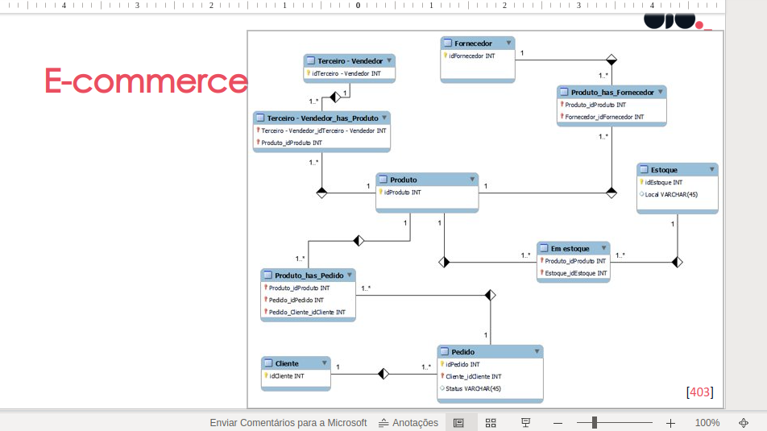
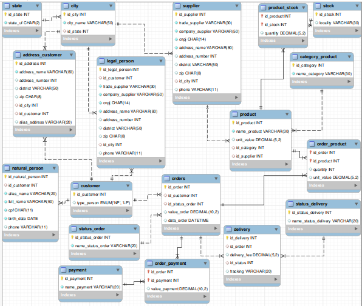

# desafio-ecommerce
Desafio do curso de Ciência de Dados - Criando um Banco de Dados para E-commerce - conteúdo da DIO

## 1 - A partir do modelo apresentado abaixo, criar o modelo relacional para ser utilizado em um e-commerce.

## 2 - Criar o script SQL para criação do esquema de banco de dados

## Resolução do desafio proposto

Fazendo primeiro refinamento do projeto inicial
Criado tabela cliente com os seguintes campos:
- id_customer - id do cliente
- alias_name: ao invés de separar nome em First Name e Last Name optei por utilizar um nome alternativo, que o usuário possa cadastrar o nome que gostaria de ser chamado
- full_name: nome completo do cliente
- cpf: único para cada cliente cadastrado
- birth_date: data de nascimento
- phone: número de telefone
Decidi não incluir o endereço nesta tabela, entendendo que o cliente pode ter mais que um endereço.

Criado tabela de endereços, como cada endereço tem cidade e estado que se repetem, foi criado também uma tabela para cada uma destas entidades, linkando através do id
- Tabela Estado
  - id_state: id do estado
  - state_uf: sigla do estado da federação
- Tabela Cidade
  - id_city: id da cidade
  - city_name: nome da cidade
  - id_state: id do estado para linkar com a tabela de estados
- Tabela de endereços
  - id_address: id do endereço
  - address: logradouro
  - number: número da rua
  - district: bairro
  - zip: CEP
  - id_city: id da cidade para linkar com a tabela de cidades
  - id_customer: id do cliente para linkar com a tabela de clientes
  - alias_address: apelido do endereço Ex. casa, trabalho

Criado tabela de fornecedores, e utilizando as tabelas de cidade e estado já criada na etapa anterior
- id_supplier: id do fornecedor
- trade: nome fantasia
- company: razão social
- cnpj: único para cada fornecedor cadastrado
- phone: número de telefone
- address: logradouro
- number: número da rua
- district: bairro
- zip: CEP
- id_city: id da cidade para linkar com a tabela de cidades

Criado tabela de categoria de produtos
- id_category: id da categoria de produtos
- name_category: nome da categoria

Criado tabela de produtos
- id_product: id do produto
- name_product: nome do produto
- unit_value: valor unitário do produto
- id_category: id da categoria para linkar com a tabela de categorias de produtos
- id_supplier: id do fornecedor para linkar com a tabela de fornecedores

Criado tabela de pagamentos
- id_payment - id da forma de pagamento
- name_payment - tipo da forma de pagamento

Criado tabela de status do pedido
- id_status_order: id do status do pedido
- name_status_order: nome do status do pedido

Criado tabela de pedidos
- id_order: id do pedido
- id_customer: id do cliente linkar com tabela de clientes
- id_status_order: id do status do pedido linkar com tabela de status
- id_payment: id da forma de pagamento linkar com tabela de payment
- value_order: valor total do pedido
- delivery_fee: taxa de entrega
- date_order: data do pedido

Criado tabela pedido x produto
para que cada pedido possa ter mais de um produto
- id_order: id do pedido linkar com tabela de pedidos
- id_product: id do produto linkar com tabela de produtos
- quantity: quantidade de produto
- unit_value: valor unitário do produto

Criado tabela estoque
- id_stock: id do estoque
- locality: local do estoque

Criado tabela estoque x produto
- id_stock: id do estoque linkar com a tabela estoque
- id_product: id do produto linkar com a tabela produto
- quantity: quantidade de produto em estoque

Resultado após primeiro refinamento

Fazendo segundo refinamento

Alterado tabela cliente:
- id_consumer: id do cliente
- type_person: tipo do cliente (NP, LP)

Criado tabela pessoa física (natural_person):
- id_natural_person: id da pessoa física
- id_customer: id do cliente linkar com a tabela cliente
- alias_name: apelido do cliente
- full_name: nome completo do cliente
- cpf: único para cada cliente cadastrado
- birth_date: data de nascimento
- phone: número de telefone

Criado tabela pessoa jurídica (legal_person):
- id_legal_person: id da pessoa jurídica
- id_customer: id do cliente linkar com a tabela cliente
- trade: nome fantasia
- company: razão social
- cnpj: único para cada fornecedor cadastrado
- phone: número de telefone
- address: logradouro
- number: número da rua
- district: bairro
- zip: CEP
- id_city: id da cidade para linkar com a tabela de cidades

Tabela de pedidos:
- retirado o id_payment para poder ter mais de uma forma de pagamento no pedido
- retirado o delivery_fee

Criado tabela pedido x forma de pagamento:
id_order: id do pedido
id_payment: id da forma de pagamento
value_payment: valor do pagamento

Criado tabela status do delivery:
- id_status_delivery: id do status do delivery
- name_status_delivery: nome do status do delivery

Criado tabela delivery:
- id_delivery: id do delivery
- id_order: id do pedido linkar com a tabela pedidos
- delivery_fee: valor da taxa de entrega
- id_status: id do status do delivery linkar com a tabela status do delivery
- tracking: código do rastreio

Resultado após segundo refinamento

## 3 - Persistência de dados para testes

Utilizado arquivo inserts.sql para popular o banco de dados.

## 4 - Recuperação de informações com queries SQL

- relação de fornecedores por ordem alfabética com máscara no CNPJ e Telefone
- relatório de produtos por ordem de fornecedor e quantidade em estoque
- Resumo das vendas de um determinado dia com quantidade de pedidos, valor total dos pedidos, ticket médio, menor valor de pedido e maior valor de pedido
- Quantidade de pedidos por consumidor
- Pedidos com mais de uma forma de pagamento

## Considerações Finais
Foi utilizado o MYSQL Workbench com uma imagem docker mysql para realizar os testes.